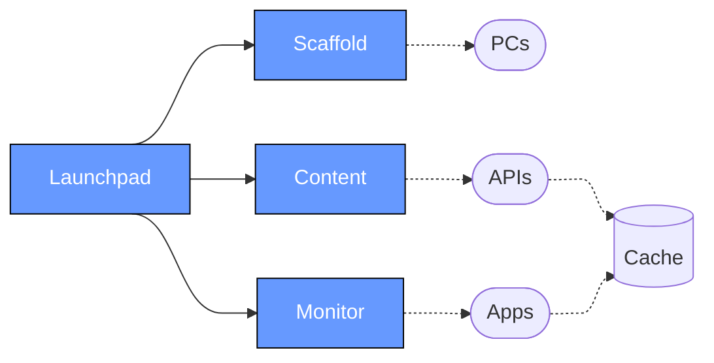

# 🚀 Launchpad

Launchpad is a highly configurable suite of tools to manage media installations. It can:

- Launch, control and monitor muiltiple processes (via [PM2](https://pm2.keymetrics.io/))
- Download and locally cache content from various common web APIs
- Bootstrap Windows PCs with common exhibit settings
- Consolidate and route application logs
- [...and much more](#documentation)



## Getting Started

1. Install launchpad: `npm i @bluecadet/launchpad`
2. Create a `launchpad.config.js` config (see [configuration](#configuration))
3. _Optional: [Bootstrap](/packages/scaffold) your PC with `npx launchpad scaffold`_
4. Run `npx launchpad`


Run `npx launchpad --help` to see all available commands.

_Note: Launchpad is typically triggered run by a startup task (e.g. Windows Task Scheduler) using `npx launchpad`. When installed globally (`npm i -g @bluecadet/launchpad`), you can use the `launchpad` command instead. See [config loading](#config-loading) for more info._

## Configuration

Each [launchpad package](#packages) is configured via its own section in `launchpad.config.js`. Below is a simple example that uses the [`content`](/packages/content) package to download JSON and images from Flickr and [`monitor`](/packages/monitor) to launch a single app:

```js
import { defineConfig } from "@bluecadet/launchpad";

export default defineConfig({
	content: {
		sources: [
			{
				id: "flickr-images",
				files: {
					"spaceships.json":
						"https://api.flickr.com/services/feeds/photos_public.gne?format=json&nojsoncallback=1&tags=spaceship",
					"rockets.json":
						"https://api.flickr.com/services/feeds/photos_public.gne?format=json&nojsoncallback=1&tags=rocket",
				},
			},
		],
	},
	monitor: {
		apps: [
			{
				pm2: {
					name: "my-app",
					script: "my-app.exe",
					cwd: "./builds/",
				},
			},
		],
	},
});
```

_Note: [Scaffold](/packages/scaffold) is configured separately in a PowerShell file. This is a guided process when you run `npx launchpad scaffold`._

### Documentation

All available config settings across packages can be found in the links below:

- [**`monitor`**](/packages/monitor/README.md): Run and monitor apps
- [**`content`**](/packages/content/README.md): Download and cache remote content
  - `sources`: An array containing one or more of the following content source options:
    - [`airtable`](/packages/content/docs/airtable-source.md): Download content from Airtable
    - [`contentful`](/packages/content/docs/contentful-source.md): Download content from Contentful
    - [`json`](/packages/content/docs/json-source.md): Download content from JSON endpoints
    - [`strapi`](/packages/content/docs/strapi-source.md): Download content from Strapi
    - [`sanity`](/packages/content/docs/sanity-source.md): Download content from Sanity
- [**`logging`**](/packages/launchpad/docs/logging.md): Route logs to the console and to files
- [**`hooks`**](/packages/launchpad/docs/hooks.md): Execute scripts before or after common events (e.g. after content has been updated)

### Config Loading

- By default, Launchpad looks for `launchpad.config.js`, `launchpad.config.mjs`, `launchpad.json` or `config.json` at the cwd (where you ran `npx launchpad`/`launchpad` from)
- You can change the default path with `--config=<YOUR_FILE_PATH>` or `-c=<YOUR_FILE_PATH>` (e.g. `npx launchpad --config=../settings/my-config.json`)
- If no config is found, Launchpad will traverse up directories (up to 64) to find one
- All config values can be overridden via `--foo=bar` (e.g. `--logging.level=debug`)

### `.env` Files

Launchpad uses [dotenv](https://github.com/motdotla/dotenv) to load in environment variables from `.env` and `.env.local` files located in the same directory as your config file.

Environment variables are loaded before the config file is parsed, so you can use them in your config file. For example, you can use `process.env.MY_ENV_VAR` in your config file to access the value of `MY_ENV_VAR` in your `.env` file.

> [!WARNING]  
> We recommend using `.env.local` for sensitive credentials that should not be committed to source control. You should add `*.local` to your `.gitignore` to avoid them being checked into git.

All Launchpad CLI commands also accept `--env <ENV_FILE_PATH(S)>` (alias `-e`) options to manually specify one or more `.env` files to load. These paths are relative to the CWD (where you ran `npx launchpad`/`launchpad` from).

```sh
# Load ../.env then ../.env.develop
npx launchpad -e ../.env -e ../.env.develop
```

Additionally, the `--cascade-env=<ENV_NAME>` (alias `-E`) option which will load the following files located alongside your config file:

- `.env`
- `.env.local`
- `.env.<ENV_NAME>`
- `.env.<ENV_NAME>.local`

## Packages

This repo is a monorepo that includes the following packages:

- [`@bluecadet/launchpad`](/packages/launchpad)
- [`@bluecadet/launchpad-content`](/packages/content)
- [`@bluecadet/launchpad-monitor`](/packages/monitor)
- [`@bluecadet/launchpad-scaffold`](/packages/scaffold)
- [`@bluecadet/launchpad-utils`](/packages/utils)

Each of these packages can be launched and configured independently (except for utils), so if you only need app-monitoring or content updates, you can install only `@bluecadet/launchpad-monitor` or `@bluecadet/launchpad-content`.

## Requirements

Launchpad requires Node `>=17.5.0` and NPM `>=8.5.1` for Windows API integration and workspaces support.

We recommend installing the latest version of NodeJS and NPM via [nvm-windows](https://github.com/coreybutler/nvm-windows):

```
nvm install latest
nvm use latest
npm i -g npm@latest
```
